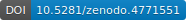
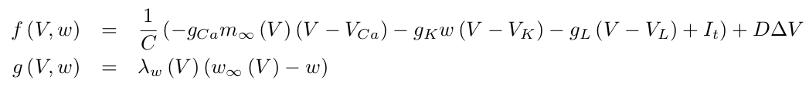
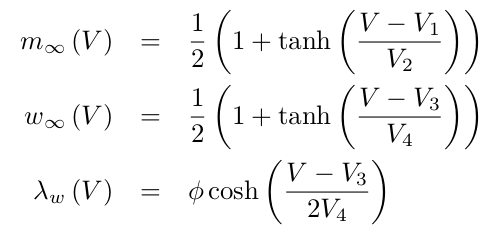
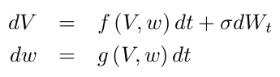

# Morris-Lecar lattice model in *Python* and *julia*

This repo contains implementations of the Morris-Lecar model of cellular excitability on a 2D lattice.  
The code is available in Python and Julia.  

**Ref.:** Morris, C., Lecar, H., Voltage oscillations in the barnacle giant muscle fiber. __*Biophys J*__ 35:193-213, 1981.

**Rendered page:** https://frederic-vw.github.io/morris-lecar-2d/

**_Python_ Requirements:**
1. [python](https://www.python.org/) installation, latest version tested 3.6.9
2. python packages (`pip install package-name`)
  - NumPy
  - Matplotlib
  - opencv-python (save data as movie)

**_Julia_ Requirements:**
1. [julia](https://julialang.org/) installation, latest version tested 1.6.1
2. julia packages (`julia > using Pkg; Pkg.add("Package Name")`)
  - NPZ
  - PyCall (load Matplotlib animation functionality)
  - PyPlot
  - Statistics
  - VideoIO (save data as movie)

## Morris-Lecar model

The Morris-Lecar model uses two variables to model membrane potential dynamics in response to current injections, as modelled form experiments in the barnacle giant muscle fiber. The two variables represent voltage ($V$), and the fraction of open K+ channels. 
Spatial coupling is introduced via diffusion of the voltage variable ($D \Delta V$):

and the steady-state functions

Noise is added via stochastic integration of the variable $V$:

The main function call running the simulation is: `ml2d(N, T, t0, dt, s, D, gL, VL, gCa, VCa, gK, VK, C, I, V0, V1, V2, V3, V4, phi, stim, blocks)`:  
- `N`: lattice size `(N,N)`
- `T`: number of simulation time steps
- `t0`: number of 'warm-up' iterations
- `dt`: integration time step
- `s`: noise intensity (&sigma;)
- `D`: diffusion constant
- `gL,VL,gCa,VCa,gK,VK,C,V1,V2,V3,V4,phi`: Morris-Lecar model parameters, `I`: stimulation current amplitude
- `V0`: initial membrane voltage
- `stim`: stimulation current parameters, array of time-, x-, and y-interval borders
- `blocks`: conduction blocks, array of x- and y-interval borders

**Outputs:** `(T,N,N)` array as NumPy .npy format and as .mp4 movie.

In example 1, use
- `stim = [ [[50,250], [0,5], [0,5]], [[6200,6700], [25,30], [0,15]] ]`
- `blocks = [ [[0,15], [5,10]] ]`
(works in Python, in Julia change 0 to 1)

### Example-1
Stimulation in the lower left corner generates a travelling wave along a narrow channel formed by the left boundary and the conduction block defined by `blocks`, an early after-depolarization within the partially refractory region generates a spiral wave.
Parameters:  
`N = 128, T = 10000, t0 = 1000, dt = 0.01, s = 2.0, D = 0.8, gL = 2.0, VL = -60.0, gCa = 5.0, VCa = 120.0, gK = 6.0, VK = -84, C = 5.0, V0 = -60.0, V1 = -1.2, V2 = 18.0, V3 = 12.0, V4 = 17.4, phi=1/15, I=90.0`

<video src="videos/ml2d_I_90.00_s_2.00_D_0.80.webm" width="256" height="256" controls preload></video>

### Conclusions
The Morris-Lecar lattice model can produce spiral waves and other travelling waves.
